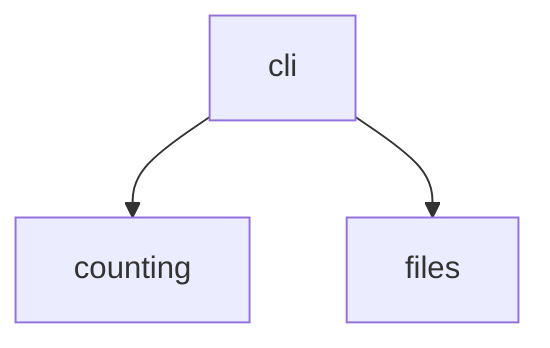

# Tally — Architecture

## 1. Structural model

| Area | Owns | May depend on |
| --- | --- | --- |
| counting | Pure word counting over a string | Nothing |
| files | Reading files into strings, read failures as values | Nothing |
| cli | Arguments, output text, exit status | counting, files |

Forbidden:

- `counting` performs no I/O.
- `files` never prints or exits.

## 2. Critical invariants

- Read failures are returned as values; only `cli` turns them into text and exit codes.
- Counting is a pure function of its input string.
- A failing file never hides the results of the other files.
