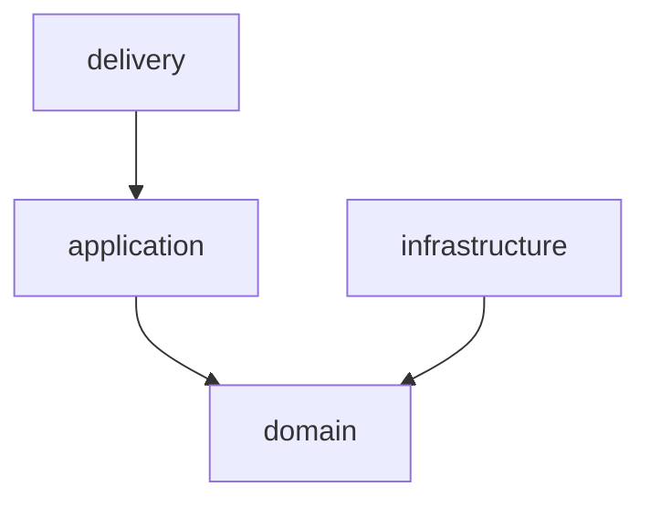

# What each document owns

Five documents only work as a system if each one answers a different question.
When two documents describe the same decision, they start disagreeing the moment
one is updated, and a reader has no way to tell which is current. The chain is:

> Product requirements constrain architecture; architecture constrains technical
> design; implementation follows all three. Conventions apply to everything.

Use this file to place an answer the interview produced, and to catch the
boundary mistakes below.

| Document | Answers | Mostly made of | Never contains |
| --- | --- | --- | --- |
| `SPECIFICATION.md` | What the product does, for whom, and when it is done | Numbered requirement rows | Any technology name |
| `ARCHITECTURE.md` | What may depend on what, and what must always hold | A Mermaid graph, a layer table, one-line invariants | Library or framework choices |
| `TECHNICAL_DESIGN.md` | Which technologies, directories, interfaces and commands | Choice tables, a directory tree, signatures | Product rationale, iteration order |
| `CODING_CONVENTIONS.md` | How code is named, shaped and tested | A vocabulary table and rule rows | Structural rules (those are architecture) |
| `DEVELOPMENT_PLAN.md` | In what order, and how each step is proven | Task blocks in the parsed format | Rules — it references them by ID |

The recurring mistake is **the plan absorbing everything**. It is the document
people read most, so rules drift into it and stop being enforceable, because
`review-step` looks for rules in the architecture and conventions. Keep the plan
as ordering and evidence only.

Stack primers in `docs/primers/` are not a sixth document: they hold idioms, not
rules. See `primers.md`.

---

## SPECIFICATION.md

Owns product behavior, requirement IDs, and completion criteria — in the
vocabulary of someone using the product, not building it.

```markdown
# <Project> — Product Specification

<One paragraph: what it is and who it is for.>

## 1. Product and scope
## 2. <Primary structure — navigation, commands, endpoints; whatever fits>
## 3. <Core capability area>
## 4. <Core capability area>
## 5. <Cross-cutting requirements — language, accessibility, privacy>
## 6. Failure and recovery behavior
## 7. Later goals
```

Requirement IDs carry the weight here. Group them by area with a short prefix
and number them within it (`ACCT-01`, `BILL-04`, `NOTIF-02`). Each ID should mark
one behavior specific enough that a reviewer can tell whether a diff satisfies
it. They are the join key the plan references and `next-step` greps for, so
define each one exactly once, as the first cell of a table row or the start of a
bullet — the syntax is in `plan-format.md`.

Section 6 is the one most often skipped and most often needed. Specify what the
user sees while loading, when a result set is empty, when an operation fails,
and what a retry does. Without it, the plan has nothing but happy paths to test.

Section 7 exists to hold everything ruled out of the first release, so ambitions
have somewhere to live other than the plan.

**Boundary check:** if a sentence here would change when you swap a library, it
belongs in the technical design.

---

## ARCHITECTURE.md

Owns layer responsibilities, dependency direction, runtime guarantees, and the
invariants a reviewer enforces. Technology-independent: it constrains the choices
made in the technical design without making them.

```markdown
# <Project> — Architecture

## 1. Context and architectural drivers
## 2. Structural model
### Layer roles
### Boundaries and dependencies
### Ownership
## 3. Runtime behavior
### Composition and lifecycle
### State and asynchronous operations
### <Persistence / navigation / concurrency — whatever the project has>
## 4. Boundary contracts
### Values and external data
### Errors
### Configuration
## 5. Verification and tradeoffs
## 6. Critical invariants
```

The layer model must fit the project. A CLI, an HTTP service, a mobile app and a
library have different shapes, and a borrowed model produces rules nobody
follows. What is not optional is that *some* explicit model exists with
directional rules, because that is what `review-step` measures against.

Carry the dependency rules as a table plus a Mermaid graph, not as sentences:

~~~markdown


| Area | Owns | May depend on |
| --- | --- | --- |
| domain | Values, identity, failure vocabulary | Nothing |
| application | Use cases, ports | domain |
~~~

Then a short bullet list of the **forbidden** imports, since permissions alone
leave every other combination ambiguous. One line each, no justification:

> - Domain imports nothing from the project.
> - Application reaches the world only through ports.

Section 6 is a short list of one-line assertions, each derived from a decision
above, each checkable against a diff. Examples of the right grain:

> - An order's total always equals the sum of its lines.
> - Report success only after the storage transaction commits; preserve existing
>   data when validation fails.
> - Keep credentials out of diagnostics.

Anything that needs a paragraph to check is not an invariant — it is a design
section, and it stays above.

**Boundary check:** if a sentence names a package, move it to the technical
design and leave the rule behind.

---

## TECHNICAL_DESIGN.md

Owns technology choices, the directory layout, concrete interfaces, and the
verification commands. This is where names appear.

```markdown
# <Project> — Technical Design

## 1. Foundation and decision status
## 2. Technologies
## 3. Organization and interfaces
## 4. <Per-area design sections — as many as the project needs>
## 5. Verification and enforcement
```

Section 1 separates settled decisions from open ones. An honest "open" is worth
more than a confident guess the code later contradicts.

Section 2 gives each significant choice a reason one clause long, the length of
a label — what it gives this project, never a comparison with the alternative
it beat.

Section 3 maps directories to the architecture's layers explicitly, so a boundary
violation shows up as a wrong import path rather than a judgement call.

Section 5 names the actual commands — type check, lint, test, boundary check,
build — because `review-step` runs them as evidence. A described check that has
no command is a check nobody runs.

**Boundary check:** if a sentence explains why the product behaves a certain way
for its users, it belongs in the specification.

---

## CODING_CONVENTIONS.md

Owns naming, file shape, and test style. Unlike the three above, it applies to
every task rather than to the layers one task touches.

```markdown
# <Project> — Coding Conventions

## 1. Vocabulary
## 2. Naming
## 3. Files and imports
## 4. Types and values
## 5. Failures and validation
## 6. Tests
## 7. Formatting, comments, and enforcement
```

Section 1 is the highest-value part: a table of the project's domain words, one
agreed term per concept, with the near-synonyms it replaces.

| Concept | Use | Not |
| --- | --- | --- |
| A stored user entry | `entry` | `item`, `record`, `row` |

Naming drift is the most expensive inconsistency because it stays invisible until
a rename touches forty files. State the rule that a renamed concept is renamed
everywhere in the same change — including tests and test identifiers — since a
half-applied rename is worse than either name.

Section 7 should say what is enforced automatically versus by review. A
convention that can't be checked against a diff is decoration; either automate it
or drop it.

**Boundary check:** "the view never imports the repository" is a structural rule
and belongs in the architecture. "Repository files are named `<noun>Repository`"
belongs here.

---

## DEVELOPMENT_PLAN.md

Owns iteration order, task status, and verification checkpoints — nothing else.
Its format is a machine contract; see `plan-format.md` before writing it.
